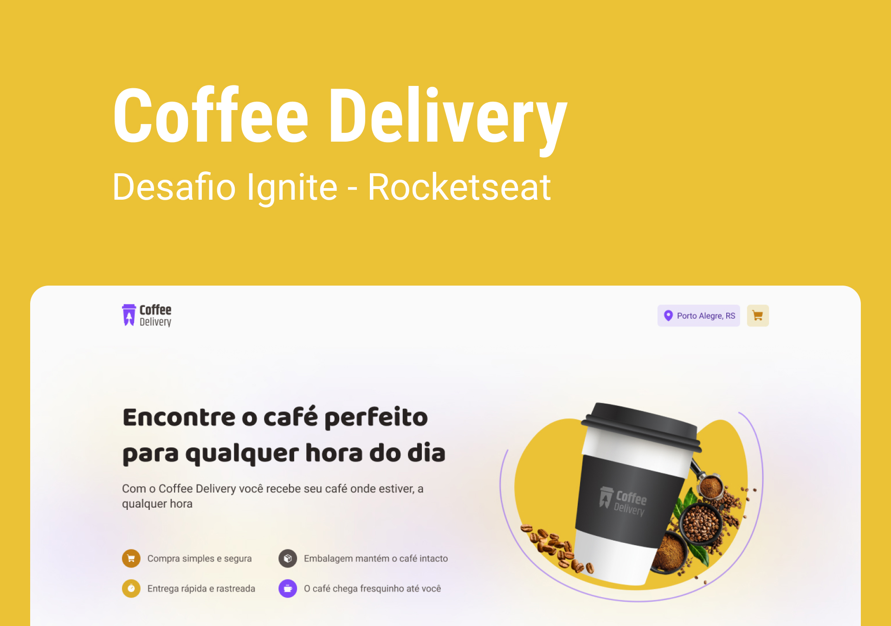

# Coffee Delivery

Um dos desafios organizado pela [Rocketseat](https://www.rocketseat.com.br/), na trilha ReactJS do curso de especialização Ignite. Esse é o segundo desafio.

## A ideia

Foi desenvolver uma aplicação que tenha um carrinho de compras de uma cafeteria fictícia, com as seguintes funcionalidades:

- Listagem de produtos (cafés) disponíveis para compra
- Adicionar uma quantidade específicas de itens no carrinho
- Aumentar ou remover a quantidade de itens no carrinho
- Formulário para o usuário preencher o seu endereço
- Exibir o total de itens no carrinho no Header
- Exibir o valor total da soma de itens no carrinho multiplicados pelo valor

Lembrando de vários assuntos e conhecimentos adquiridos no curso como: 

- Estados
- ContextAPI
- LocalStorage
- Listas e chaves no ReactJS
- Componentização

## Design

Nas instruções do desafio, tinha um link para o layout da aplicação, bem [aqui](https://www.figma.com/file/5yT9ZzZmRQRS4yivGGB3pl/Coffee-Delivery/duplicate).

> Vai direto pro Figma, duplicando o projeto na sua conta. Se você não tiver, crie uma por esse link [aqui](https://www.figma.com/signup)
